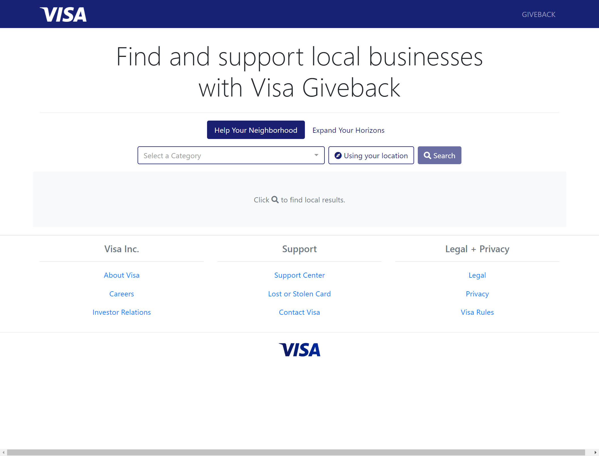
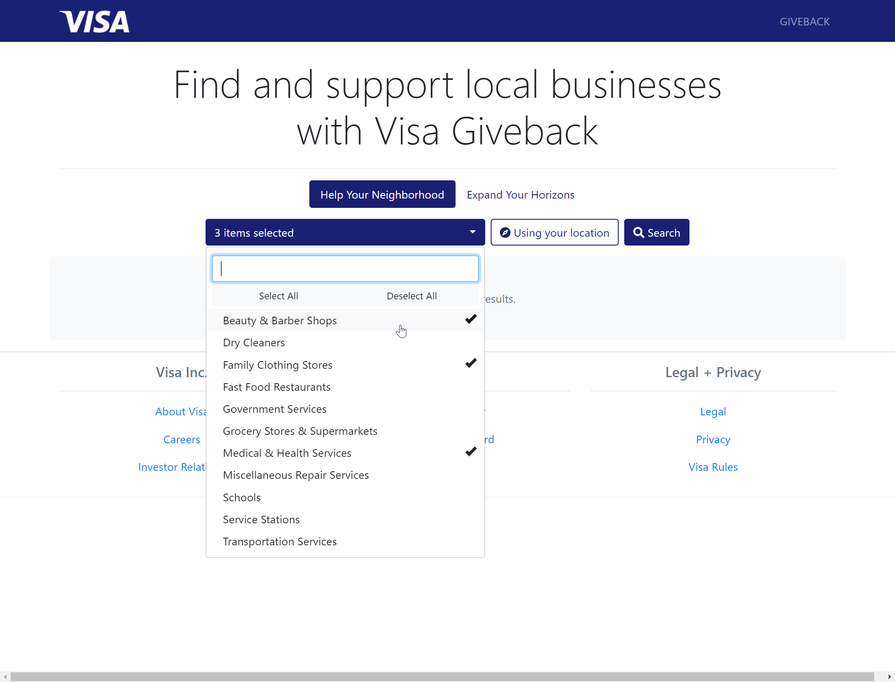
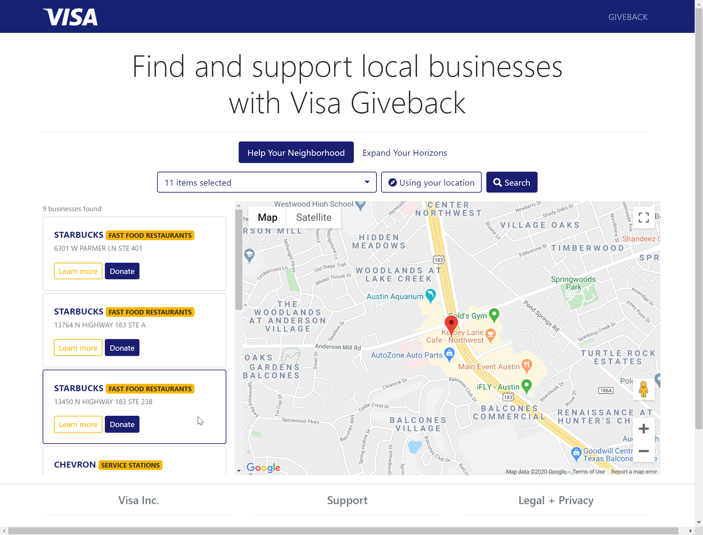
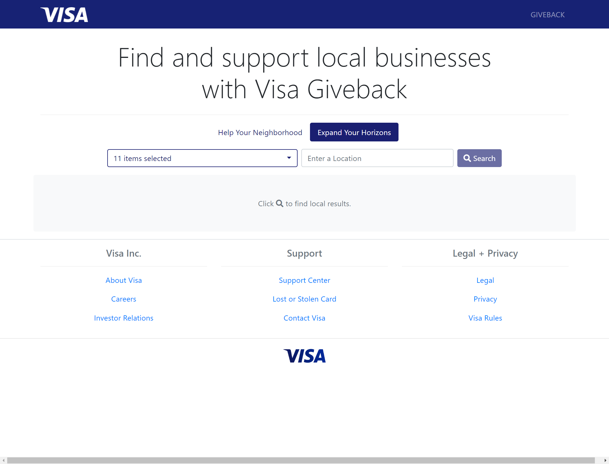
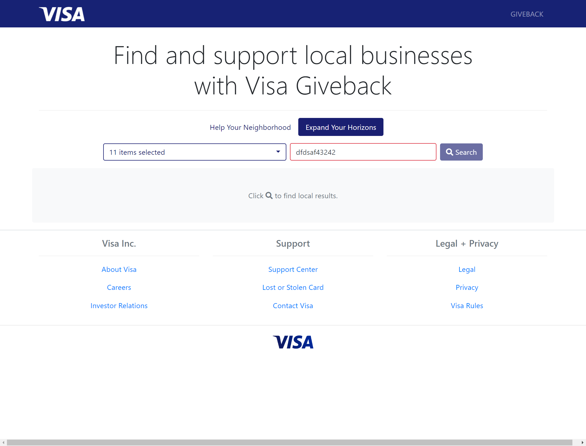
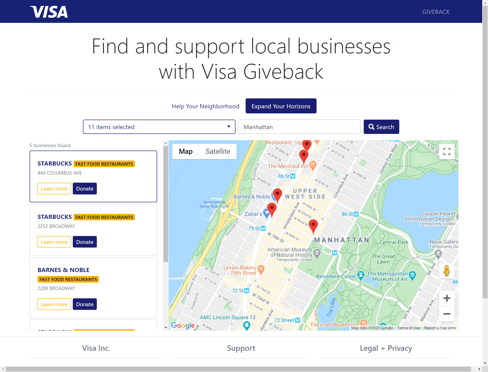
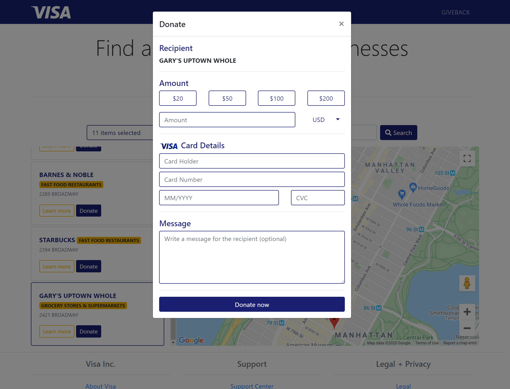
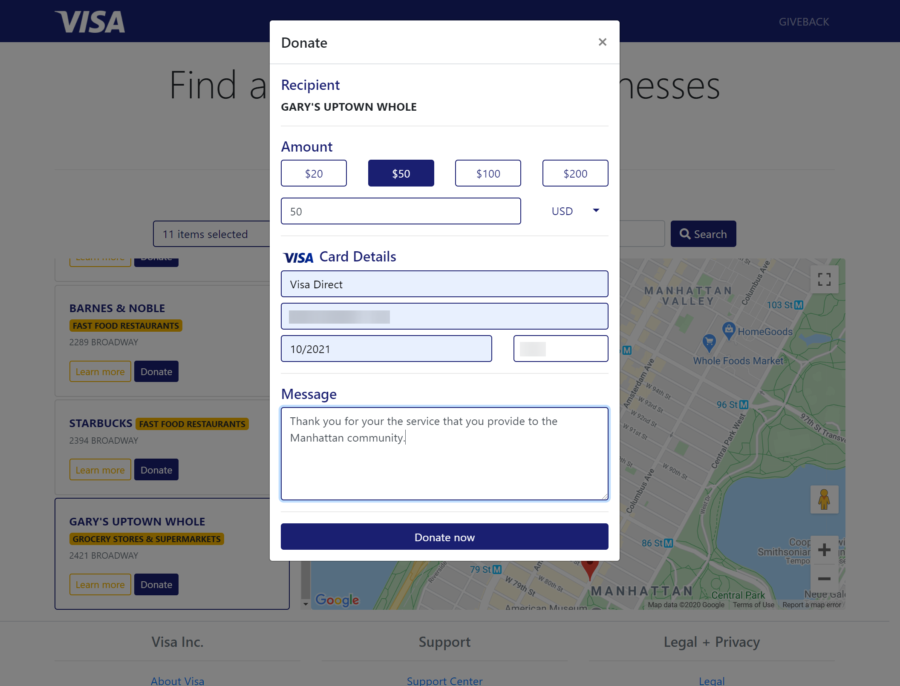
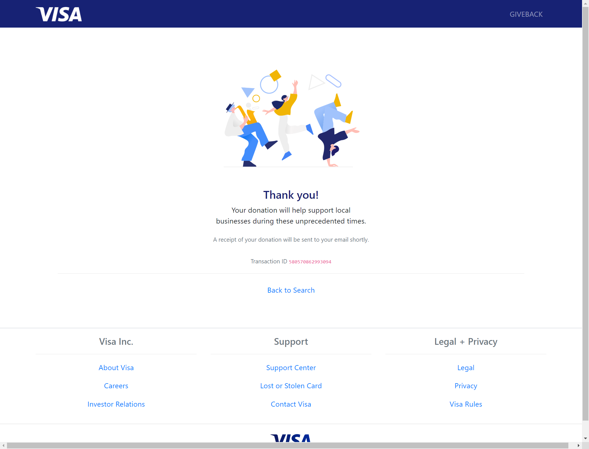

# Visa Giveback

**Visa Giveback is not an official Visa product. This is a hackathon project for demonstration
purposes only.**

 
## Help Your Neighborhood
The following images display the workflow of completing a local search. To accomplish a local search, we use the 
JavaScript Geolocation API.

## Expand Your Horizons
The following images display the workflow of completing a specified location search. In this workflow, the JavaScript
Geolocation API is replaced with the Google Maps Geocoding API. Additionally, the "using your location" button is
replaced with a text input field. When the user enters a location query in the field, it's checked
against the API and we determine the relevant latitude and longitude.

As seen below, an invalid location query results in a disabled search button and a red border to indicate the issue.
In future revisions, given more time, we would have liked to provide additional indication of the issue to the user.
When the location entered is valid, the user is reaffirmed with a Visa-blue outline.

Below, we see the results of a search for all 11 categories of business in Manhattan, New York City, New York.

## Making a Donation
Each business result has a "Donate" button for users to start the donation process. We also have a "Learn more" option,
but it's not yet implemented.

Users can select between several preset amounts, or write their own. If the user types an amount that is already
listed, the button will be activated as if they had selected it.

Upon completing a successful donation, users are thanked for their contribution and given their transaction ID.
